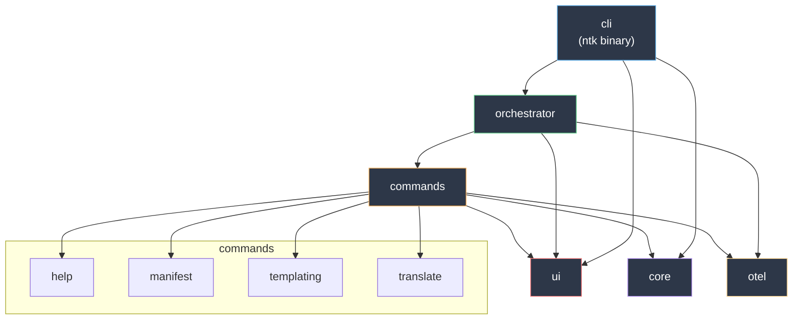

# NetToolsKit CLI

> Interactive command-line interface for .NET development with templates, manifests, and automation tools


---

## Introduction

NetToolsKit CLI solves the problem of fragmented .NET development workflows by providing a unified, interactive command-line interface for project scaffolding, template management, and development automation. The technical approach follows a modular Rust-based architecture inspired by GitHub Codex CLI, featuring an interactive command palette system and high-performance async operations.

Objectives:

- Provide a fast, interactive CLI for common .NET development tasks
- Standardize project setup via templates and manifest-driven configuration
- Enable repeatable automation flows (without ad-hoc scripts per repo)
- Keep the UX discoverable with a command palette and consistent navigation

---

## Features

-   ✅ Interactive terminal interface with `/` command palette activation
-   ✅ Real-time command filtering with intuitive arrow navigation
-   ✅ Modular workspace architecture with 10 specialized crates
-   ✅ High-performance async I/O with Tokio multi-thread runtime
-   ✅ Template scaffolding and project generation via Handlebars
-   ✅ Manifest-driven solution configuration and application
-   ✅ OpenTelemetry-inspired observability with timing and metrics
-   ✅ Ollama integration for AI-powered development assistance
-   ✅ Layered user configuration (`~/.ntk/config.toml`, env vars, defaults)
-   ✅ Graceful degradation: auto-detects color/unicode support, ASCII fallback
-   ✅ Cross-platform terminal handling (Windows Terminal, conhost, Unix)

---

## Contents

- [Introduction](#introduction)
- [Features](#features)
- [Contents](#contents)
  - [Architecture](#architecture)
  - [Crates](#crates)
  - [Operations](#operations)
- [Build and Tests](#build-and-tests)
- [Contributing](#contributing)
- [Dependencies](#dependencies)
- [References](#references)
- [License](#license)

---

### Architecture



---

### Crates

This workspace is organized as a multi-crate Rust project. Each crate has its own README with scoped documentation.

| Crate | Description | README |
|-------|-------------|--------|
| `cli` | Interactive entry point, event loop, and display | [crates/cli/README.md](crates/cli/README.md) |
| `core` | Shared domain types, configuration, and utilities | [crates/core/README.md](crates/core/README.md) |
| `ui` | Terminal UI primitives, capabilities, and rendering | [crates/ui/README.md](crates/ui/README.md) |
| `otel` | Observability, timing, and telemetry metrics | [crates/otel/README.md](crates/otel/README.md) |
| `orchestrator` | High-level command orchestration and execution | [crates/orchestrator/README.md](crates/orchestrator/README.md) |
| `commands` | Command dispatch layer and feature crates | [crates/commands/README.md](crates/commands/README.md) |
| `help` | Help discovery and display utilities | [crates/commands/help/README.md](crates/commands/help/README.md) |
| `manifest` | Manifest parsing, validation, and execution | [crates/commands/manifest/README.md](crates/commands/manifest/README.md) |
| `templating` | Template rendering and resolution via Handlebars | [crates/commands/templating/README.md](crates/commands/templating/README.md) |
| `translate` | Template translation handler and types | [crates/commands/translate/README.md](crates/commands/translate/README.md) |

---

### Operations

Operational runbook and incident procedures:

- [Incident Response and Troubleshooting Playbook](docs/operations/incident-response-playbook.md)

---

## Build and Tests

This repository uses standard Cargo workflows for building, testing, formatting, linting, and documentation generation.

```bash
# Build all crates
cargo build --workspace

# Run all tests
cargo test --workspace

# Run unit tests only
cargo test --workspace -- --lib

# Lint
cargo clippy --workspace -- -D warnings

# Format
cargo fmt --all

# Generate documentation
cargo doc --workspace --no-deps
```

---

## Contributing

We follow semantic versioning and conventional commits. Please ensure your contributions:

1. **Follow Git Flow**: Create feature branches from `main`
2. **Write Tests**: Maintain test coverage for new features (unit + integration)
3. **Use Semantic Commits**: Follow conventional commit format (`feat:`, `fix:`, `docs:`, `refactor:`)
4. **Update Documentation**: Keep README and inline docs current
5. **Pass CI**: Ensure `cargo build`, `cargo test`, `cargo clippy`, and `cargo fmt` all pass

---

## Dependencies

### Runtime

| Crate | Version | Purpose |
|-------|---------|---------|
| `tokio` | 1.34+ | Async runtime with multi-threading |
| `clap` | 4.4+ | Command-line argument parsing |
| `crossterm` | 0.28+ | Cross-platform terminal manipulation |
| `serde` / `serde_json` | 1.0+ | Serialization framework |
| `handlebars` | 6.2+ | Template engine |
| `reqwest` | 0.11+ | HTTP client (Ollama integration) |
| `owo-colors` | 3.5+ | Terminal color output |
| `supports-color` | 2.1+ | Color capability detection |
| `inquire` | 0.9+ | Interactive prompts |
| `toml` | 0.8+ | Configuration file parsing |
| `dirs` | 5.0+ | Platform-standard directories |
| `tracing` | 0.1+ | Structured logging |

### Development

| Crate | Version | Purpose |
|-------|---------|---------|
| `insta` | 1.41+ | Snapshot testing |
| `assert_cmd` | 2.0+ | CLI integration testing |
| `criterion` | 0.5+ | Benchmarking |
| `tempfile` | 3.10+ | Temporary file utilities |
| `serial_test` | 3.2+ | Sequential test execution |

---

## References

### Documentation

- Crate documentation:
  - [crates/cli/README.md](crates/cli/README.md)
  - [crates/commands/README.md](crates/commands/README.md)
  - [crates/commands/help/README.md](crates/commands/help/README.md)
  - [crates/commands/manifest/README.md](crates/commands/manifest/README.md)
  - [crates/commands/templating/README.md](crates/commands/templating/README.md)
  - [crates/commands/translate/README.md](crates/commands/translate/README.md)
  - [crates/core/README.md](crates/core/README.md)
  - [crates/orchestrator/README.md](crates/orchestrator/README.md)
  - [crates/otel/README.md](crates/otel/README.md)
  - [crates/ui/README.md](crates/ui/README.md)
  - [docs/operations/incident-response-playbook.md](docs/operations/incident-response-playbook.md)

### External References

- [Rust Async Programming](https://rust-lang.github.io/async-book/)
- [Clap CLI Framework](https://docs.rs/clap/latest/clap/)
- [Tokio Async Runtime](https://tokio.rs/tokio/tutorial)
- [Handlebars Template Engine](https://docs.rs/handlebars/latest/handlebars/)
- [Crossterm Terminal Library](https://docs.rs/crossterm/latest/crossterm/)
- [GitHub Codex CLI Design](https://github.com/github/copilot-cli) (inspiration)

---

## License

This project is licensed under the MIT License. See the LICENSE file at the repository root for details.

---
