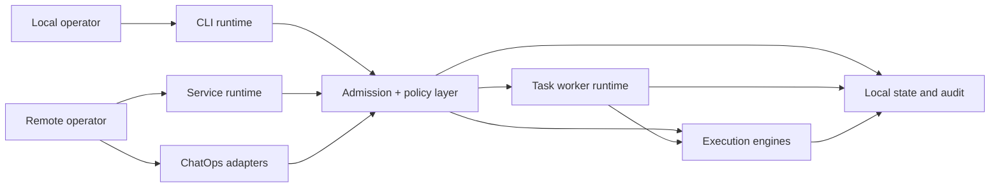

# Control Plane, Session, and Operator Model

## Status

This document is the formal Phase 10.6 control-plane specification for NetToolsKit.
It defines:

- the current implementation baseline
- the target architecture boundary for commercial evolution
- the contracts that future runtime, gateway, and approval work must preserve

This is intentionally local-first. Remote control is supported, but persistent state remains local to the machine or mounted service volume unless a future phase explicitly adds remote projection.

Implementation note:

- The baseline typed contracts `OperatorContext`, `SessionContext`, `ControlPolicyContext`, and `ControlEnvelope` now exist in [runtime.rs](../../crates/core/src/runtime.rs).
- HTTP service ingress now emits the shared envelope for `/task/submit`, and ChatOps `submit` intents now derive the same typed envelope before task admission.
- Non-submit ChatOps actions (`list`, `watch`, `cancel`, `help`) still use the legacy command path and remain a follow-up adoption slice.

## Design Goals

- Keep `cli` and `service` runtime modes under one coherent control model.
- Make operator identity, session ownership, and task admission explicit.
- Preserve safe-by-default behavior for local and VPS deployments.
- Keep transports replaceable without changing task semantics.
- Treat auditability as a first-class contract, not an implementation detail.

## Canonical Terms

### Control Plane

The control plane is the set of ingress, policy, routing, and audit components that decide whether work is admitted, how it is attributed, and how it is tracked.

In NetToolsKit today, the control plane spans:

- local interactive CLI input
- service HTTP ingress
- ChatOps Telegram/Discord ingress
- task admission and worker dispatch
- local audit persistence
- repo workflow policy gates

### Data Plane

The data plane is the execution layer that performs the admitted work:

- command execution
- AI task execution
- repository workflow execution
- worker retries and cancellations

### Operator

An operator is the actor requesting work from the control plane.

Operator identity must answer:

- who requested the work
- through which ingress
- under which authorization policy
- with which allowed scopes

### Session

A session is the bounded context that groups related requests, state, and audit records for one operator workflow.

Sessions can be interactive, AI-specific, service-scoped, or remote-control scoped.

### Task

A task is the queued or directly executed unit of work represented by:

- `TaskIntentKind`
- `TaskIntent`
- `TaskExecutionStatus`
- `TaskAuditEvent`

These contracts already exist in [runtime.rs](../../crates/core/src/runtime.rs).

## Current Implementation Baseline

| Boundary | Current implementation | Source of truth |
|---|---|---|
| Runtime mode | `cli` or `service` resolved from config/env | [runtime.rs](../../crates/core/src/runtime.rs) |
| Local interactive control plane | `rustyline` input, command palette, persisted local CLI snapshots | [main.rs](../../crates/cli/src/main.rs), [state.rs](../../crates/cli/src/state.rs) |
| Service control plane | `axum` HTTP stack with auth, request IDs, body limit, readiness, timeout | [main.rs](../../crates/cli/src/main.rs) |
| Remote ChatOps ingress | Telegram/Discord envelopes, allowlists, signatures, replay guard, throttling | [chatops.rs](../../crates/orchestrator/src/execution/chatops.rs), [chatops_runtime.rs](../../crates/orchestrator/src/execution/chatops_runtime.rs) |
| Background execution | bounded worker runtime with retry and cancellation | [lib.rs](../../crates/task-worker/src/lib.rs) |
| Repository automation | policy-gated `clone -> branch -> execute -> commit -> push -> PR` flow | [repo_workflow.rs](../../crates/orchestrator/src/execution/repo_workflow.rs) |
| AI session persistence | local JSON snapshots and active AI session handle | [ai_session.rs](../../crates/orchestrator/src/execution/ai_session.rs) |

## Runtime Topology



## Session Model

NetToolsKit currently has multiple session-like boundaries. They need to be treated as one model instead of unrelated storage details.

| Session kind | Current identifier | Storage | Current purpose | Target role |
|---|---|---|---|---|
| Interactive CLI session | `session-*` snapshot id | local JSON snapshot | local command/text history | human operator workspace session |
| AI session | `ai-*` active session id | local JSON snapshot | reuse AI context across `/ai` commands | resumable reasoning context |
| HTTP request session | `x-request-id` | request/response only | ingress traceability | per-request envelope ID |
| Task session | `task-*` id | task audit trail | worker lifecycle tracking | execution unit within a larger operator session |
| ChatOps operator session | implicit `platform + user_id + channel_id` | audit + ingress state | remote command attribution | first-class remote session identity |

### Required Identifier Hierarchy

The long-term hierarchy is:

- `request_id`: one inbound request/message
- `correlation_id`: one end-to-end operation chain
- `session_id`: one resumable operator context
- `task_id`: one execution unit

Current implementation partially covers this:

- `request_id` exists on service HTTP and ChatOps ingress
- `session_id` exists for local CLI and AI sessions
- `task_id` exists in task execution and audit
- `correlation_id` exists in tracing/logging but is not yet uniformly attached to all ingress types

## Operator Model

### Operator Kinds

| Operator kind | Current support | Identity evidence | Notes |
|---|---|---|---|
| Local human operator | implemented | local workstation/process context | trusted by local machine boundary |
| Remote human operator | implemented through service and ChatOps | bearer token or platform user/channel identity | typed operator contract is now emitted for service `/task/submit` and ChatOps `submit`; remaining remote actions still need unification |
| Automation operator | partially implemented | service token + policy-gated repo workflow | intended for background daemon/VPS flows |
| Platform adapter | implemented | Telegram/Discord adapter identity | ingress proxy, not the final human operator |

### Operator Responsibilities

Every admitted request should be attributable to:

- one operator kind
- one operator identifier
- one ingress transport
- one scope set
- one policy decision

Today this is spread across:

- bearer token checks for service mutation endpoints
- ChatOps allowlists and command scopes
- repo workflow policy gates
- local CLI trust boundary

The target state is a single `OperatorContext` contract shared by all transports.
That type now exists in `nettoolskit-core`, but not all ingress paths populate it yet.

## Target Control Envelope

The target architecture should converge on a transport-neutral envelope like this:

```json
{
  "request_id": "req-1737000000000-00000001",
  "correlation_id": "session-main-1737000000000-00000001",
  "runtime_mode": "service",
  "operator": {
    "kind": "remote_human",
    "id": "telegram:777",
    "channel_id": "telegram:555",
    "authn": "telegram_signature+allowlist",
    "scopes": ["submit:ai-plan", "watch"]
  },
  "session": {
    "kind": "chatops",
    "id": "chatops-telegram-777-555",
    "resumable": true
  },
  "task": {
    "intent_kind": "ai_plan",
    "title": "Plan CI hardening rollout",
    "payload": "design CI hardening rollout"
  },
  "policy": {
    "approval_required": true,
    "mutable_actions_allowed": false
  },
  "audit": {
    "persist_local": true,
    "store": "chatops/audit.jsonl"
  }
}
```

This envelope is now represented by `ControlEnvelope` in `nettoolskit-core`.
It is not fully emitted by every ingress yet, so future phases should wire CLI, remaining ChatOps actions, and gateway transports to submit this same semantic model end to end.

## Transport Mapping

| Transport | Current state | Identity source | Session source | Future direction |
|---|---|---|---|---|
| Local CLI | implemented | local process/user context | CLI snapshot session | keep as primary local operator mode |
| Service HTTP | implemented | bearer token plus optional `x-ntk-operator-id` | per-request `x-request-id` or `x-ntk-session-id` | typed envelope metadata is emitted on `/task/submit` and now persists into task audit/registry |
| Telegram webhook/polling | implemented | platform user + channel + webhook security | derived `chatops-telegram-<user>-<channel>` for submit intents | typed envelope now drives `submit`; non-submit actions still use legacy command routing |
| Discord interactions/polling | implemented | platform user + channel + signature | derived `chatops-discord-<user>-<channel>` for submit intents | typed envelope now drives `submit`; non-submit actions still use legacy command routing |
| Gateway/WebSocket | not implemented | not yet available | not yet available | add multi-client control plane without changing task semantics |

## Authorization and Approval Model

### Current Rules

- Local CLI runs inside the local trust boundary.
- Service mode is loopback-first and requires bearer auth for mutable HTTP submission when exposed.
- ChatOps ingress uses explicit allowlists, command scopes, replay protection, and rate limiting.
- Repository workflow is deny-by-default and blocked unless explicitly enabled and allowlisted.

### Target Rules

- All remote operators must resolve to a first-class operator identity.
- Mutating intents must carry an approval state, not only a transport-level auth check.
- Approval history must be auditable and resumable.
- Operator scopes must be independent from transport details.

## Persistence and Data Boundaries

NetToolsKit intentionally keeps persistence local-first:

- CLI session snapshots: local JSON
- AI session snapshots: local JSON
- task audit trail: local persistence
- ChatOps audit trail: local JSONL
- ingress replay cache: memory or local file
- repo workflow workspaces: local filesystem

This matches the current product direction:

- strong local performance
- explicit VPS deployability
- low token and infrastructure overhead
- no hidden external control-plane dependency

## Alignment with Codex and OpenClaw

This model is aligned to a practical subset of the reference systems:

- Codex-inspired principles:
  - local-first developer workflow
  - explicit instruction and policy boundaries
  - session/task correlation around real engineering work
- OpenClaw-inspired principles:
  - transport-neutral control plane
  - separation of operator, session, and execution concerns
  - readiness for gateway/control-UI style expansion

NetToolsKit intentionally does not claim parity today with:

- a multi-tenant gateway
- a browser control UI
- remote session orchestration across multiple nodes
- full RBAC/operator approval workflows

Those remain future phases built on top of this specification.

## Implementation Follow-Up After This Spec

1. Finish adopting typed `ControlEnvelope` for non-submit ChatOps actions and local CLI task ingress.
2. Attach `operator_id`, `session_id`, and `correlation_id` consistently to all audit trails and outward notifications.
3. Introduce a formal approval state machine for mutating AI and repository actions.
4. Add optional gateway/WebSocket transport that reuses the same control envelope instead of inventing a second control path.

## Reference Inputs

- OpenAI Codex repository and agent guidance:
  - https://github.com/openai/codex
  - https://github.com/openai/codex/blob/main/AGENTS.md
- OpenClaw architecture and gateway references:
  - https://docs.openclaw.ai/concepts/architecture
  - https://docs.openclaw.ai/gateway/protocol
  - https://docs.openclaw.ai/start/wizard